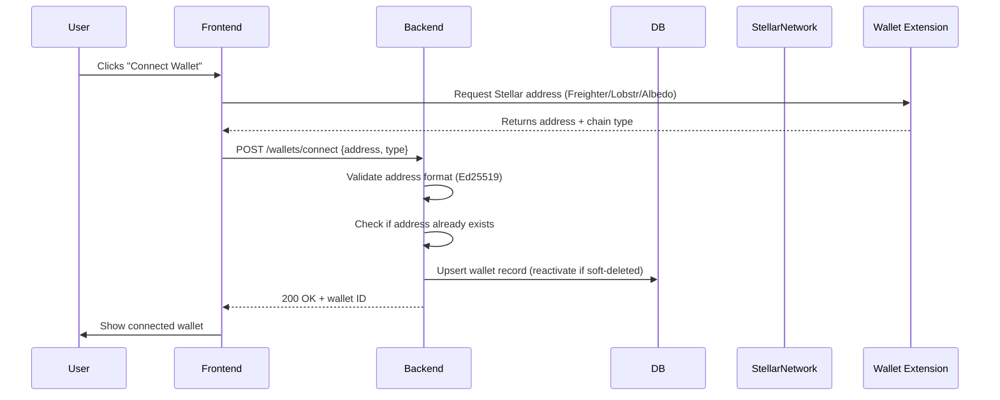
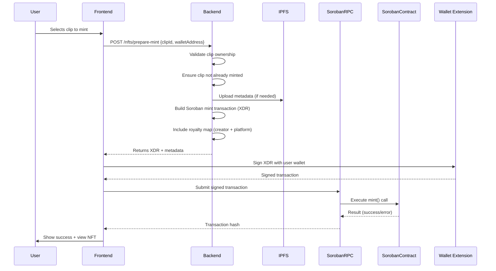
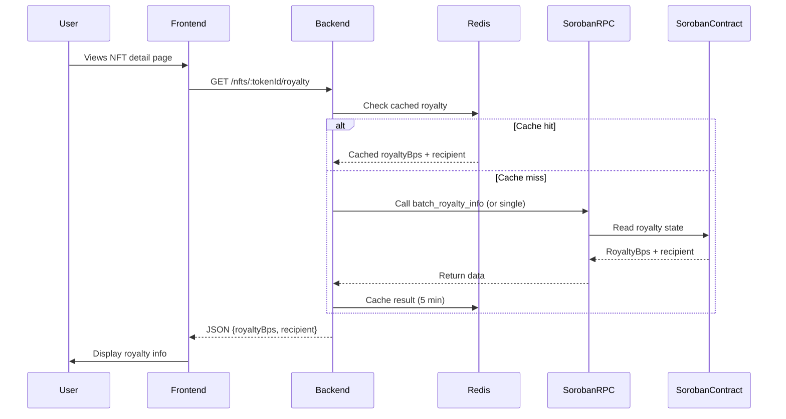
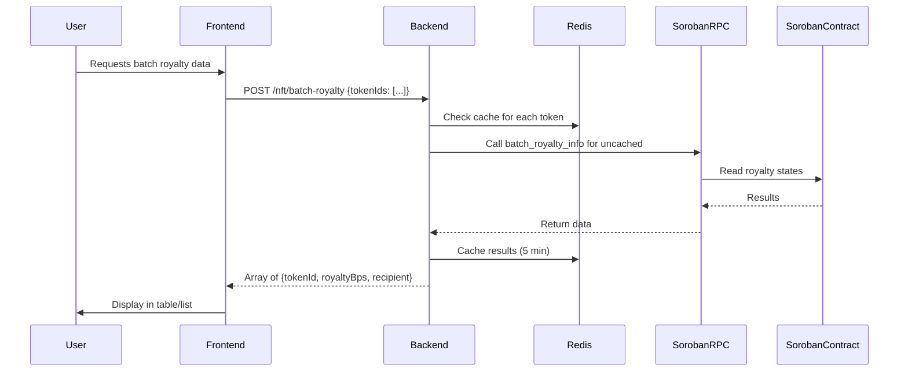

# Wallet Integration Flow

This document describes the end-to-end flow for connecting a Stellar wallet and interacting with the Soroban NFT royalty contract, from frontend user action through backend processing to on-chain execution.

## Overview

The integration involves three main components:
1. **Frontend** (user interface, wallet connector)
2. **Backend API** (NestJS/Node.js services)
3. **Soroban Network** (Stellar blockchain + smart contracts)

The backend acts as an orchestrator: it validates inputs, prepares transaction XDR, and interacts with Soroban RPC, but **never handles user private keys**. All signing happens client-side.

## Flow Diagrams

### 1. Wallet Connection Flow

### 2. NFT Mint Flow (Two-Step)

### 3. Royalty Query Flow

### 4. Batch Royalty (Public Endpoint)

## API Endpoint Reference

| Endpoint | Method | Auth | Description |
|----------|--------|------|-------------|
| `/wallets/connect` | POST | JWT | Connect Stellar wallet |
| `/wallets/:id` | DELETE | JWT | Disconnect wallet |
| `/nfts/prepare-mint` | POST | JWT | Prepare mint transaction XDR |
| `/nfts/:mintAddress/royalty` | GET | Optional | Query single token royalty |
| `/nft/batch-royalty` | POST | None | Batch royalty query (max 100) |
| `/platform/revenue` | GET | Optional | Platform earnings from contract |

## Security Notes

- **Private keys never leave user device**: All signing occurs in wallet extension/frontend.
- **Backend validates**: Address format, ownership, duplicate minting.
- **Rate limiting**: Applied to prevent abuse (see `rate-limits.md`).
- **Environment variables**: 
  - `STELLAR_NETWORK`: `testnet` or `public`
  - `SOROBAN_NFT_CONTRACT_ID`: Deployed contract address
  - `PLATFORM_WALLET_ADDRESS`: Royalty recipient
  - `PINATA_JWT`: For IPFS metadata upload

## Related Documentation

- [`stellar-integration.md`](stellar-integration.md): Deep dive into backend services
- [`PAYOUT_ARCHITECTURE.md`](PAYOUT_ARCHITECTURE.md): XLM payout flows for off-clip earnings
- [`queue-architecture.md`](queue-architecture.md): Background job processing
- [`testing-strategy.md`](testing-strategy.md): How integration is tested

## Diagram Source

The sequence diagrams above use Mermaid syntax and can be rendered with:
- [Mermaid Live Editor](https://mermaid.live)
- VS Code + Mermaid plugin
- MkDocs with mermaid extension
